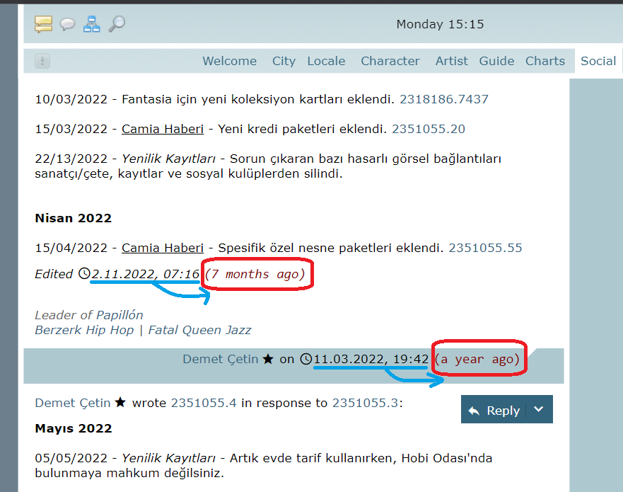

### PURPOSE OF THE SCRIPT
> This script enables displaying the creation and modification dates of the [popmundo](https://www.popmundo.com) game forum messages as text, based on the browser's language settings. This allows for a better understanding of when a forum message was posted.

___

### For install via userscript manager such as [Tampermonkey](https://www.tampermonkey.net/) 
> Navigate to [user script](https://github.com/AhmetEmsal/user-scripts/raw/master/Popmundo/scripts/ForumPostTimestamp/script.user.js) in a browser that has any script manager browser extension installed!

___

### Screenshots

Open
<blockquote>
    
</blockquote>
